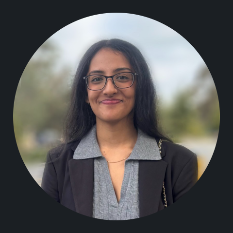
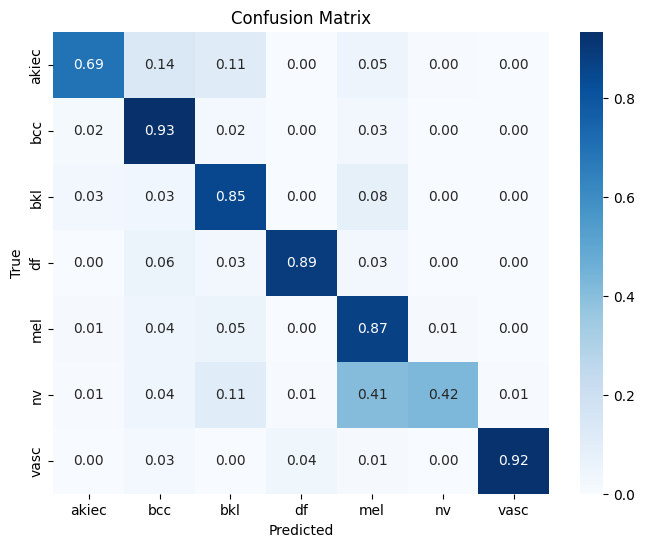

# **Angel Thakur's User Page**

## Table of Contents
- [**Angel Thakur's User Page**](#angel-thakurs-user-page)
  - [Table of Contents](#table-of-contents)
  - [Background](#background)
  - [My Programming Interests](#my-programming-interests)
  - [Personal](#personal)
  - [Future Goals](#future-goals)

---



## Background

I am a student at UC San Diego pursuing a bachelor's degree in Computer Science. I have experience programming in **Python, Java, and C/C++.** I have also prior experience in designing machine learning pipelines, database systems, analysis of efficient programming practices, and computing mentorship. The following is a link to my LinkedIn page for more information on my past projects. 

[**LinkedIn**](https://www.linkedin.com/in/angel-thakur)

Below, I have also included a snippet of my code where I am working on data augmentation for the training of a ML model with transfer learning. 

```
weights = MobileNet_V3_Large_Weights.DEFAULT
preprocess = weights.transforms()  # includes ToTensor + normalization

pil_transforms = T.Compose([
    T.RandomHorizontalFlip(),
    T.RandomVerticalFlip(),
    T.RandomRotation(20),
    T.RandomAffine(degrees=0, translate=(0.1,0.1), shear=10),
    T.ColorJitter(brightness=0.2, contrast=0.2, saturation=0.2, hue=0.1)
])

tensor_transforms = T.Compose([
    T.RandomErasing(p=0.5, scale=(0.02,0.2), ratio=(0.3,3.3), value='random')
])

train_transforms = T.Compose([pil_transforms, preprocess, tensor_transforms])
val_transforms = preprocess

train_meta.transform = train_transforms
val_meta.transform = val_transforms
test_meta.transform = val_transforms
```

The following is the confusion matrix for the skin lesion classes we are attempting to identify with our model. The model is still currently under development.


To view some of my work with git, see 


## My Programming Interests 

I am currently interested in the **creation and development of machine learning models.** I enjoy exploring the wide variety of applications for machine learning. Much of my prior experience has gone into using AI for healthcare purposes or for optimizing developer workflows. I am interested in broadening my experience of AI applications and development. The following quote by one of the co-founders of Google Brain, Andrew Ng, is something I resonate with and am eager to expand upon.
> “AI can do anything that we are able to understand and specify. But it’s limited to what we can define and imagine.”

I am also interested in the following:
* Backend Systems
* Operating Systems
* Computer Vision

## Personal
Some of my interests include the following, in order of my practice of these hobbies.
1. Reading
2. Working out
3. Playing video games
4. Dancing
5. Photography 

## Future Goals

The following is a list of some of my future goals
- [ ] Travel the world
- [ ] Engage in tomfoolery
- [ ] Attain dream phisique (WIP)
- [ ] Attain a job in the CS industry
- [ ] Leave said 9-5 CS job as part of a midlife crisis and join a team of quirky, yet lovable indie game devs 
  


